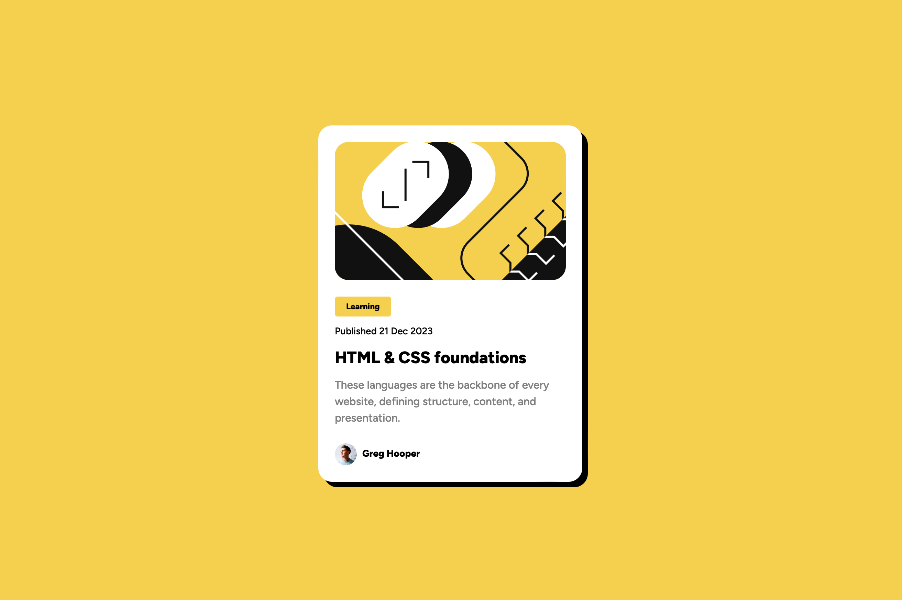

# Frontend Mentor - Blog preview card solution

This is a solution to the [Blog preview card challenge on Frontend Mentor](https://www.frontendmentor.io/challenges/blog-preview-card-ckPaj01IcS). Frontend Mentor challenges help you improve your coding skills by building realistic projects. 

## Table of contents

- [Overview](#overview)
  - [The challenge](#the-challenge)
  - [Screenshot](#screenshot)
  - [Links](#links)
- [My process](#my-process)
  - [Built with](#built-with)
  - [What I learned](#what-i-learned)
  - [Useful resources](#useful-resources)
- [Author](#author)

**Note: Delete this note and update the table of contents based on what sections you keep.**

## Overview

### The challenge

Users should be able to:

- See hover and focus states for all interactive elements on the page

### Screenshot

### Links

- Solution URL: [Add solution URL here](https://your-solution-url.com)
- Live Site URL: [Add live site URL here](https://your-live-site-url.com)

## My process

### Built with

- [React](react.dev) - JS library 
- [Tailwindcss](tailwindcss.com) - CSS Library
- Typescript

### What I learned

I learned the basics of tailwindcss and typescript. More specifically I learned that tailwindcss has a mobile-first philosophy. This is important when working with media queries. The default case is mobile and if you want you adapt your design for bigger screens, you can use prefixes like `sm`, `lg`, `xl`, or `2xl`. Before I read this I was implementing with the desktop as the default case in mind. 

### Continued development

Use this section to outline areas that you want to continue focusing on in future projects. These could be concepts you're still not completely comfortable with or techniques you found useful that you want to refine and perfect.

**Note: Delete this note and the content within this section and replace with your own plans for continued development.**

### Useful resources

- [Tailwindcss Documentation](https://tailwindcss.com) - This of course helped me a lot for tailwindcss as the documentation is very well designed and can be searched easily.

## Author

- Website - [Johannes Melsbach](https://www.melsbach.dev)
- Twitter - [@jmelsbach](https://www.twitter.com/jmelsbach)
